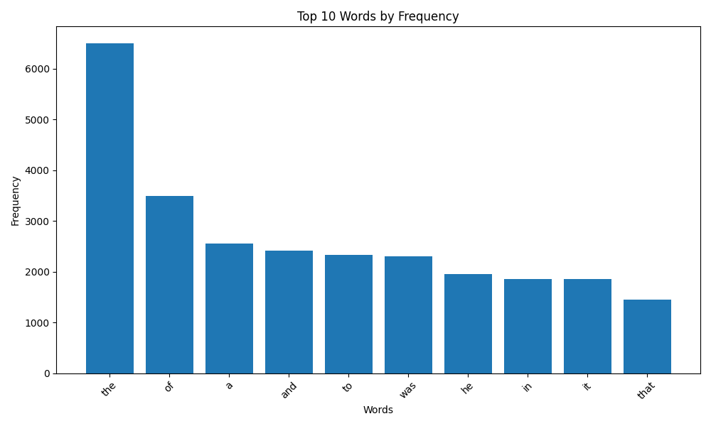

# goit-algo2-hw-06

## GOIT Design and Analysis of Algorithms Homework 6

### Requirements

- Python 3.10+
- Git

### Usage

Clone this repository:
```shell
git clone https://github.com/AntonChubarov/goit-algo2-hw-06.git
```

Navigate to project directory:
```shell
cd goit-algo2-hw-06
```

Install dependencies:
```shell
pip install -r requirements.txt
```

Run the script:
```shell
python3 map_reduce.py
```

Review top_words_plot.png file.
Example:

